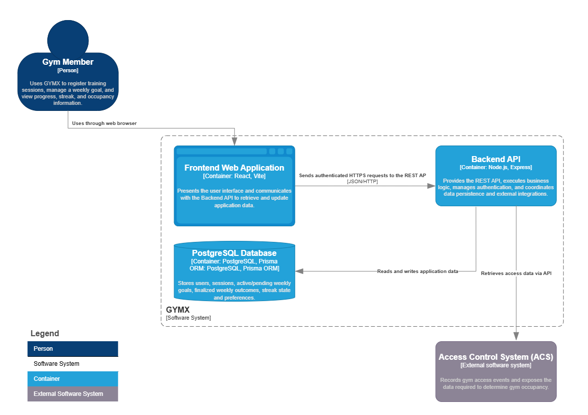
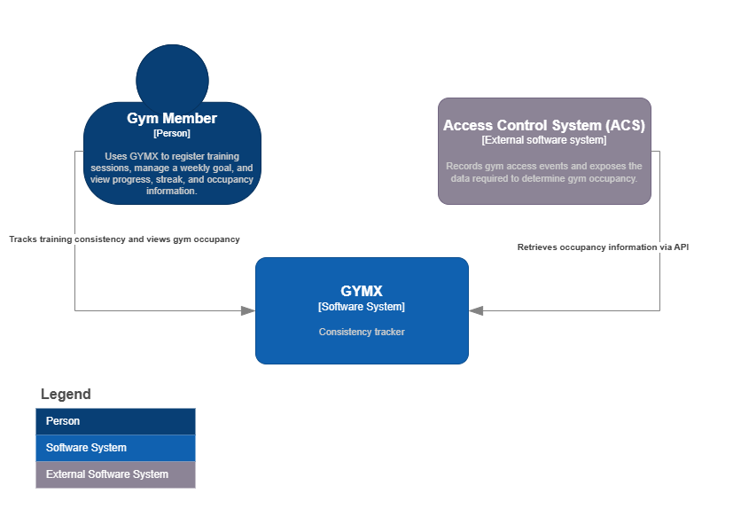
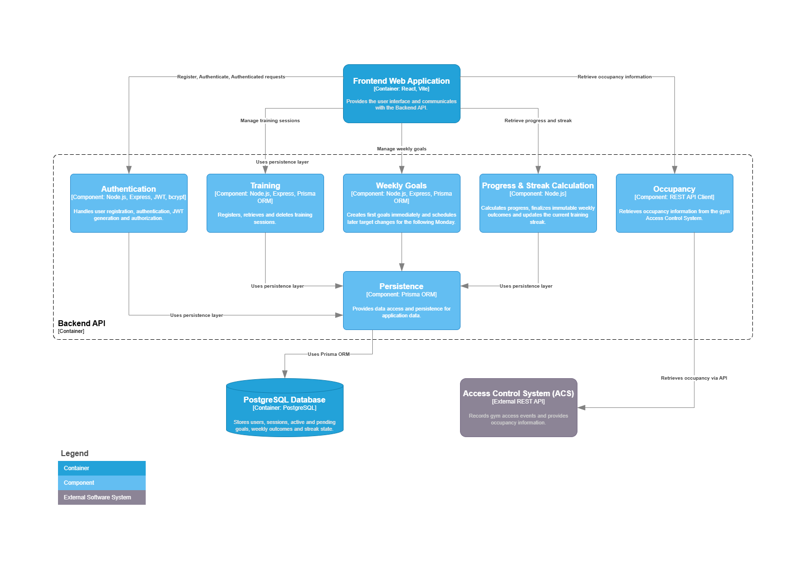

# GYMX System Architecture

## Purpose

This document describes the technical architecture of GYMX. It defines the major software components, their responsibilities, interactions, and the architectural decisions that guide the implementation of the system.

The architecture translates the business requirements defined in the Project
Specification and the authoritative Functional Specification into a
maintainable, scalable, and secure software solution.

---

# 1. Architectural Goals

The architecture has been designed to achieve the following goals.

## Simplicity

The system should remain easy to understand and maintain. Components should have clear responsibilities and minimal coupling.

---

## Separation of Concerns

The frontend, backend, database, and external integrations should each have clearly defined responsibilities.

---

## Scalability

The architecture should support future expansion without significant redesign, including additional features, multiple gyms, and external integrations.

---

## Security

Protected resources shall only be accessible to authenticated and authorized users. Sensitive information shall never be exposed unnecessarily.

---

## Maintainability

The architecture shall promote clean code, modularity, and testability by following established architectural principles.

---

## Extensibility

New business concepts should be introduced with minimal impact on existing components.

---

## Technology Independence

Business logic should remain independent from infrastructure wherever practical, allowing technologies to be replaced with minimal changes.

---

# 2. Architectural Style

GYMX follows a layered client-server architecture.

The system consists of a web-based frontend communicating with a RESTful backend over HTTPS. The backend contains the application's business logic and persists data in a relational database. External systems, such as the gym occupancy provider, are accessed through dedicated integration components.

This separation provides a clear distinction between presentation, business logic, persistence, and external services.

The overall structure of the system is illustrated in the Container Diagram.

---

# 3. System Context

GYMX operates within a small ecosystem consisting of gym members and an external Access Control System (ACS).

Gym members interact with GYMX through a web browser to register training sessions, manage weekly goals, monitor their progress, and view current gym occupancy. GYMX, in turn, retrieves occupancy information from the external Access Control System.

These relationships are illustrated in the System Context Diagram.

---

# 4. Backend Architecture

The Backend API is organised into a set of logical components, each responsible for a distinct business capability. Responsibilities such as authentication, training management, weekly goals, progress calculation, streak evaluation, occupancy integration, and data persistence are separated to promote maintainability, extensibility, and testability.

Business components interact with the persistence layer to access application data, while external integrations remain isolated within dedicated integration components. The streak evaluator finalizes completed weeks chronologically, persists one Boolean weekly outcome for each finalized week, and updates the current streak aggregate. Pending goal changes are activated only after the preceding week has been finalized using its previous target.

The backend architecture is illustrated in the Backend Component Diagram.

---

# 5. Technology Stack

| Layer | Technology |
|--------|------------|
| Frontend | React, Vite |
| Backend | Node.js, Express |
| Database | PostgreSQL |
| ORM | Prisma ORM |
| Authentication | JWT, bcrypt |
| API | REST / JSON over HTTPS |
| Testing | Vitest, Cypress |
| Documentation | OpenAPI, C4 Model |

---

# 6. Architectural Principles

The implementation of GYMX follows several architectural principles.

- Separation of concerns through a layered architecture.
- Single responsibility for each component.
- Stateless communication between frontend and backend using REST.
- Clear separation between business logic and infrastructure.
- Encapsulation of external integrations.
- Reusable and maintainable application services.
- Secure-by-default authentication and authorization.
- Extensibility for future business capabilities.

---

# 7. Architectural Decisions

The following high-level architectural decisions have been made for the current version of GYMX.

- GYMX is implemented as a web-based client-server application.
- The frontend communicates exclusively through a REST API.
- Business logic resides within the Backend API.
- PostgreSQL is used as the primary relational database.
- Prisma ORM provides database abstraction.
- JWT is used for authentication and authorization.
- Training session registration requires an existing weekly goal and is enforced by the Backend API.
- The first weekly goal takes effect immediately; later goal changes are stored as pending until the following Monday.
- Completed-week streak evaluation uses lazy catch-up and persists one immutable Boolean weekly outcome per user and week.
- Exactly-once weekly evaluation is a required invariant; its transaction and concurrency mechanism will be finalized with the evaluator design.
- Gym occupancy is retrieved from an external Access Control System through a dedicated integration component.
- The MVP targets a single gym deployment while remaining extensible for future expansion.

Further architectural decisions may be documented separately as Architecture Decision Records (ADRs) if required.
