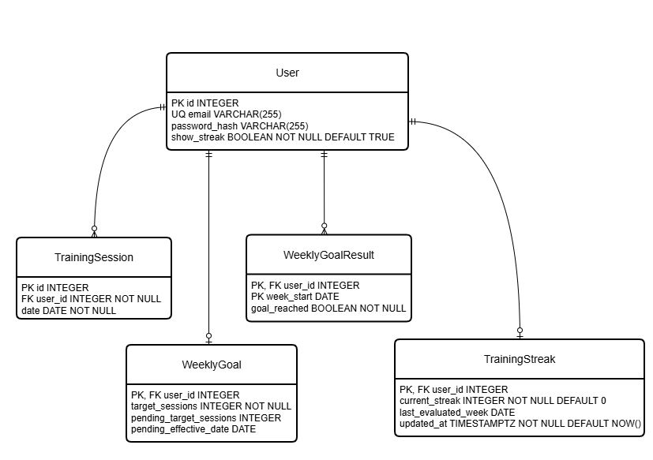

# Entity Identification

## Method

The entities included in the Entity Relationship Diagram (ERD) were identified using a structured domain-driven analysis.

The process consisted of the following steps:

1. Identify all business concepts from the Domain Analysis.
2. Evaluate whether each concept requires persistent storage.
3. Distinguish entities from derived concepts and value objects.
4. Exclude concepts managed by external systems.
5. Validate the resulting entities against the functional requirements.

A concept was modelled as an entity when it:

- has its own identity;
- has an independent lifecycle;
- requires persistent storage;
- participates in relationships with other business concepts; and
- supports one or more functional requirements.

Concepts that are calculated from existing data, represent immutable values, or are managed by external systems were not included as entities.

---

# Method Execution

The Domain Analysis identified the following concepts:

| Concept | Evaluation | Result |
|----------|------------|--------|
| User | Persistent identity with independent lifecycle | Entity |
| Training Session | Persistent record of completed gym visits | Entity |
| Weekly Goal | Persistent user configuration | Entity |
| Weekly Goal Result | Persistent final outcome for one user and completed calendar week | Entity |
| Training Streak | Persisted to optimise performance and avoid recalculating historical weeks | Entity |
| Progress | Calculated from Training Sessions and Weekly Goal | Derived Concept |
| Occupancy | Immutable snapshot retrieved from an external system | Value Object |
| Access Control System | External integration | Not an Entity |

---

# Conclusions

Applying the identification method resulted in the following entities being included in the ERD:

- User
- Training Session
- Weekly Goal
- Weekly Goal Result
- Training Streak

The following concepts were intentionally excluded from the ERD:

- Progress, because it is calculated on demand.
- Occupancy, because it is a value object supplied by an external system.
- Access Control System, because it is outside the application's bounded context.

These conclusions ensure that the ERD models only the data owned and managed by GYMX while avoiding unnecessary persistence of derived or external information.

## Indexes and Referential Actions

The following indexes and referential actions are applied to support query performance and maintain data integrity.

| Table | Column(s) | Type | Purpose |
|---|---|---|---|
| User | email | UNIQUE INDEX | Prevents duplicate user accounts and supports authentication. |
| TrainingSession | user_id, date | COMPOSITE INDEX | Supports efficient retrieval of a user's training sessions and weekly progress calculations. |
| WeeklyGoal | user_id | PRIMARY KEY / UNIQUE | Enforces one weekly goal per user. |
| WeeklyGoalResult | user_id, week_start | COMPOSITE PRIMARY KEY | Enforces one final weekly outcome per user and calendar week. |
| TrainingStreak | user_id | PRIMARY KEY / UNIQUE | Enforces one training streak record per user. |

### Referential Actions

| Foreign Key | On Delete | On Update | Reason |
|---|---|---|---|
| `TrainingSession.user_id` → `User.id` | CASCADE | NO ACTION | Training sessions depend on the user, while primary key values are treated as stable. |
| `WeeklyGoal.user_id` → `User.id` | CASCADE | NO ACTION | The weekly goal depends on the user, while primary key values are treated as stable. |
| `WeeklyGoalResult.user_id` → `User.id` | CASCADE | NO ACTION | Weekly outcomes depend on the user and have no independent lifecycle. |
| `TrainingStreak.user_id` → `User.id` | CASCADE | NO ACTION | The streak state depends on the user, while primary key values are treated as stable. |

## Design Implications

As illustrated in Figure 1, the physical data model further specifies the identified design choices through data types, constraints, indexes, and referential actions.

A composite index on `TrainingSession(user_id, date)` is added to support efficient retrieval of a user's training sessions and date-range queries used for weekly progress calculations.

`ON DELETE CASCADE` is applied to the foreign key relationships from `TrainingSession`, `WeeklyGoal`, `WeeklyGoalResult`, and `TrainingStreak` to `User`. These entities are fully dependent on the user and have no meaning without the associated user account. When a user is deleted, all related training sessions, weekly goal data, weekly outcomes, and streak data must therefore also be deleted.

`ON UPDATE NO ACTION` is applied to the foreign key relationships because primary key values are treated as stable identifiers and should not be changed after creation.

The database design decisions are directly traceable to the Functional Specification, Domain Analysis, and functional requirements. Based on this analysis, the persistent entities `User`, `TrainingSession`, `WeeklyGoal`, `WeeklyGoalResult`, and `TrainingStreak` were identified together with their relationships.

Primary keys and foreign keys are specified as follows:

- `User.id` is the primary key of `User`.
- `TrainingSession.id` is the primary key of `TrainingSession`.
- `TrainingSession.user_id` is a foreign key referencing `User.id`.
- `WeeklyGoal.user_id` is both the primary key and a foreign key referencing `User.id`.
- `WeeklyGoalResult` uses (`user_id`, `week_start`) as its composite primary key, with `user_id` also referencing `User.id`.
- `TrainingStreak.user_id` is both the primary key and a foreign key referencing `User.id`.

Using `user_id` as both primary key and foreign key in `WeeklyGoal` and `TrainingStreak` enforces that a user can have at most one weekly goal and at most one training streak record.

`WeeklyGoal` stores the active `target_sessions` together with nullable
`pending_target_sessions` and `pending_effective_date`. The first target is
active immediately. Later changes remain pending until their effective Monday.

`WeeklyGoalResult` stores only `goal_reached` in addition to its composite key.
The target and session count used during finalization are intentionally not
duplicated. Completed-week sessions are immutable, so the Boolean outcome is
final and does not require recalculation.

The design decisions align with the defined domain rules:

- A training session belongs to exactly one user.
- A user may have multiple training sessions.
- A user may have at most one weekly goal.
- A user may have multiple weekly goal results but at most one result for each calendar week.
- A user may have at most one training streak record.
- Training sessions, weekly goals, weekly goal results, and training streaks cannot exist without an associated user.

As shown in Figure 1, these rules are translated into non-identifying one-to-many relationships from `User` to `TrainingSession` and `WeeklyGoalResult`, and identifying one-to-zero-or-one relationships between `User` and both `WeeklyGoal` and `TrainingStreak`. The cardinalities and dependencies are explicitly enforced through the database constraints.

# Entity Relationship Diagram

Figure 1 presents the physical Entity Relationship Diagram (ERD) derived from the entity identification process described above. The diagram illustrates the persistent entities, their attributes, primary and foreign keys, and the relationships enforced within the GYMX database.

*Figure 1. Physical Entity Relationship Diagram.*
